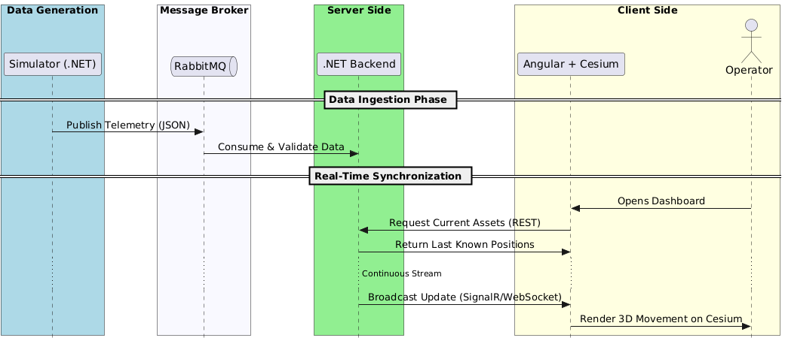
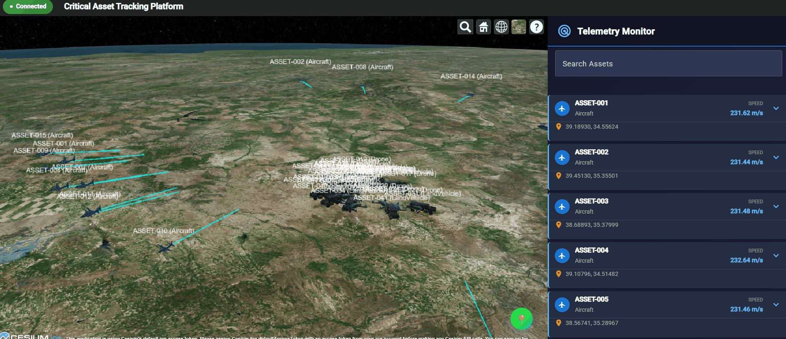

# Critical Asset Tracking Platform

[](https://github.com/bsozer06/critical-asset-tracking-platform/actions/workflows/ci.yml)

A platform for real-time tracking and visualization of assets (vehicles, aircraft, drones, etc.). Open for contributions and improvements.

---

## What's Included

- **Backend API** — Handles telemetry, validates data, and streams updates.
- **Frontend Web App** — Modern dashboard with a 3D map and live asset panel.
- **Simulator** — Generates test data for all asset types.
- **Monitoring Stack** — Prometheus metrics and Grafana dashboards for system observability.

---



---

## Quick Start

### With Docker (Recommended)
```bash
cd backend
docker compose up --build
```
- Web App: [http://localhost:5073](http://localhost:5073)
- API: [http://localhost:5073/hubs/telemetry](http://localhost:5073/hubs/telemetry)
- RabbitMQ Admin: [http://localhost:15672](http://localhost:15672) (user: `rabbitmq`, password: `rabbitmq`)
- **Grafana Dashboard**: [http://localhost:3000](http://localhost:3000) (user: `admin`, password: `admin`)
- **Prometheus Metrics**: [http://localhost:9090](http://localhost:9090)

### Local Development

1. **Backend**
  ```bash
  cd backend/Api
  dotnet restore
  dotnet build
  dotnet run
  ```
2. **Frontend**
  ```bash
  cd frontend/critical-asset-frontend
  npm install
  npm start
  ```
3. **Simulator**
  ```bash
  cd simulator/CriticalAssetSimulator
  dotnet run
  ```

---

## 4. How the Data Flows (The Pipeline)

1. **Generate**  
   The Simulator produces telemetry data and publishes it to a RabbitMQ exchange.

2. **Process**  
   The Backend consumes messages, validates payloads, and applies business rules.

3. **Broadcast**  
   Processed telemetry is pushed to all connected clients via **SignalR**.

4. **Render**  
   The Angular + Cesium application updates 3D asset models in real time.

5. **Monitor**  
   Prometheus collects system metrics, and Grafana provides visual dashboards for observability.

---

### Demo



---

## Features

- Real-time updates via SignalR
- Interactive Cesium 3D map
- Card-based telemetry panel with icons and color badges
- Zoom to asset/all features
- Geofence drawing and alerts
- Responsive, mobile-friendly design
- Data integrity checks (CRC32)
- **System monitoring with Prometheus metrics and Grafana dashboards**

---

## Configuration

- **Simulator:** `simulator/CriticalAssetSimulator/config.json` — asset counts, location, output type
- **Backend:** `backend/Api/appsettings.json` — RabbitMQ and API settings
- **Frontend:** `frontend/critical-asset-frontend/src/environments/environment.ts` — API and Cesium settings

---

## CI/CD

See [CI/CD documentation](.github/workflows/README.md) for pipeline details.

---

## Contributing

Everyone is welcome! Please:
- Use feature branches, PRs, and code review.
- Add unit tests for your changes (see frontend and backend test instructions below).
- Keep Cesium assets updated and respect their Apache 2.0 license headers.
- See [`frontend/critical-asset-frontend/README.md`](frontend/critical-asset-frontend/README.md) for frontend tests, and use `dotnet test` for backend.

---

## License

- Cesium assets: Apache 2.0 (see headers in `frontend/critical-asset-frontend/src/assets/cesium`)
- Project code: See LICENSE file if present

---

## Troubleshooting

**Telemetry missing in the UI:**
- Ensure backend and frontend are running and hub URLs match
- Check backend logs for errors
- Verify RabbitMQ exchange/queue exist with correct permissions
- Default RabbitMQ: `localhost:5673`, exchange: `catp.exchange`, queue: `catp.telemetry.queue`

**Cesium errors:**
- Check static assets are loaded
- Verify `CESIUM_BASE_URL` in `index.html` and `environment.ts`

---

## More Info

- **Backend:** See [`backend/README.md`](backend/README.md)
- **Frontend:** See [`frontend/critical-asset-frontend/README.md`](frontend/critical-asset-frontend/README.md)
- **Simulator:** See [`simulator/README.md`](simulator/README.md)
